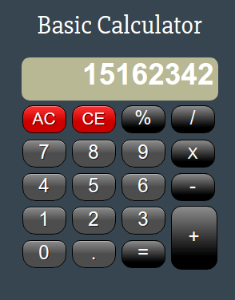

# Basic JavaScript Calculator

## Description 

This is an implementation of a basic mathematical calculator that can computer addition, subtraction, product and quotients of numbers. It can also convert to percentages and use decimal numbers.

## Live Demo

https://coymeetsworld.github.io/basic-js-calculator/

	

## Instructions

A user can click the numerical or operational buttons and the app will behave as a desk calculator would.

## About

The Basic JavaScript Calculator was written by Coy Sanders as a requirement in the [Advanced Front-End Development Projects](https://www.freecodecamp.com/challenges/build-a-javascript-calculator) for [FreeCodeCamp](http://www.freecodecamp.com) to earn the Front-End Development Certification.

software is licensed under the 

Copyright (c) 2017 